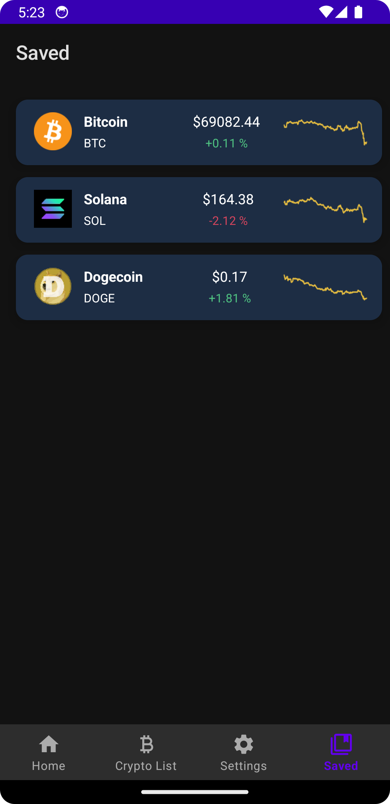

# CoinSight
CoinSight is a comprehensive cryptocurrency tracking application designed to provide users with real-time data, detailed insights, and personalized notifications for various cryptocurrencies. The application also offers features for saving favorite cryptocurrencies, adjusting settings like dark mode, and enabling location-based services.

## Features

- Real-time Cryptocurrency Data: Fetches the latest cryptocurrency data using the CoinMarketCap API.
- Market Overview: Displays a list of cryptocurrencies with up-to-date pricing, percentage changes, and more.
- Detailed Information: Provides detailed views of selected cryptocurrencies with in-depth data analysis.
- Favorite Cryptocurrencies: Save your preferred cryptocurrencies to easily track them.
- Notifications: Receive notifications about significant changes in the cryptocurrency market.
- Dark Mode: Switch between light and dark themes according to your preference.
- Location-based Services: Enable location-based services for personalized notifications and features.
- Offline Mode: View saved data even when offline by storing cryptocurrency data locally.

## Screenshots

